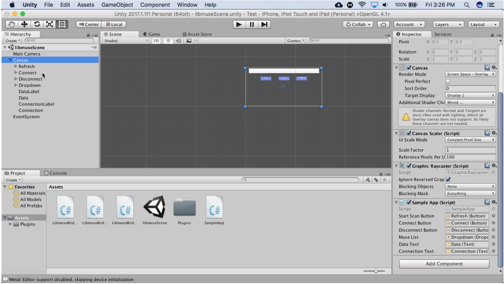

# Instructions

1. Download this repository

2. Setup a New Unity Project

  * Create a new project in Unity.
  * Copy and paste the contents in the Assets folder of the LibMuse example application into the Assets folder of your Unity project.
  * In the Assets folder in Unity, double click the libmuseScene.unity file.
  * Click on the Canvas element, then drag SampleApp.cs to the “Missing (Mono Script)” text box in the Inspector view.
  * Check if the UI controls attached to SampleApp.cs were properly initialized. If the control is set to “None” drag the appropriate controls from the left side of the screen to the controls in the Sample App script in the bottom right corner. The mapping of controls is shown in the image below.
  * 
  * This should be all you need to do and you’re ready to build and deploy the app on either iOS and Android.

2. Building for iOS
  * Under Unity -> File -> Build Setting -> Platform, select iOS and click Switch Platform.
  * Click Build. Unity will proceed to create a Xcode Project at a location you specify.
  * Open up the Xcode project Unity created for you in Xcode.
  * Under Build Settings -> Build Options -> Enable Bitcode and change to NO.
  * Under Build Phases -> Link Binary With Libraries and click the + icon and add these 2 libraries: ExternalAccessory.framework and CoreBluetooth.framework.
  * Open up the Info.plist file from the navigation side bar.
  * Hover mouse over Information Property List until a + icon shows up on the right and click to add Supported external accessory protocols field.
  * Expand this field by clicking on the triangular arrow. Double click the Value column for Item 0 to edit and input com.interaxon.muse.

3. Building for Android
  * Open the build settings from Unity -> File -> Build Settings. Under the Platform list, select Android and click Switch Platform.
  * Click Player Settings and in the Inspector under Other Settings change the Bundle Identifier to match your organization.
  * Change the Minimum API level to Android 4.4 ‘Kit Kat’ (API level 19). API level 19 is required to connect to the Muse 2016 headband.
  * Click Build. This will build an .apk file.
  * Load this file onto a device as you normally would with any other Android application.
